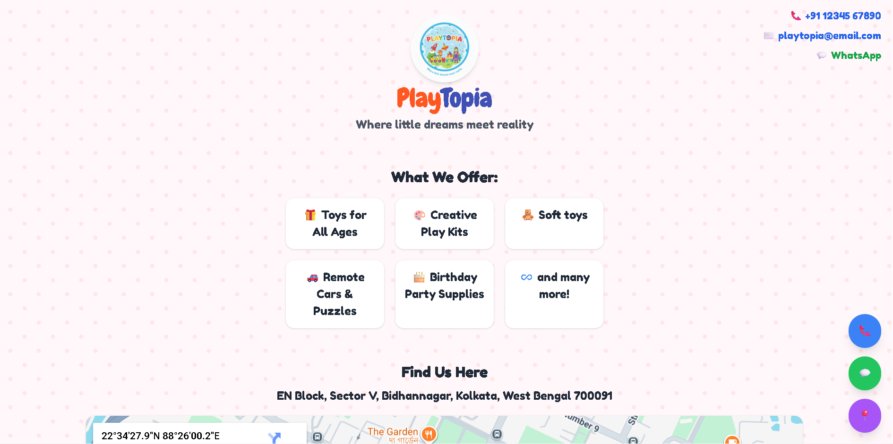
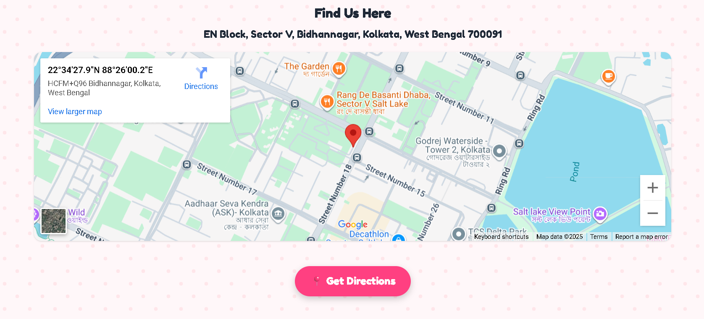
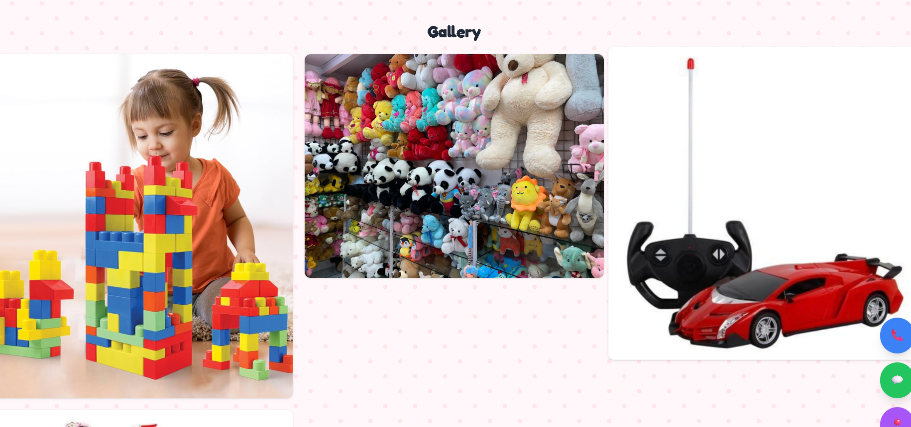

#  Playtopia – Digital Business Card

Playtopia is a **clean, playful, single-page web application** designed for small local toy shops to connect with their community.  
This project was built for a hackathon to empower businesses with a simple, mobile-friendly online presence — no complex setup needed.

##  Features

 **Playful UI** – cheerful fonts, bright theme, playful background
 **Contact Section** – phone, email & WhatsApp links in one tap  
 **Google Map Integration** – helps customers find the shop instantly  
 **Operating Hours** – clearly displayed and easy to read  
 **Photo Gallery** – showcases toys and shop atmosphere  
 **Social Media Icons** – Instagram, Facebook & Twitter links  
 **Responsive Design** – works on any screen size

##  Preview
Homepage

Map

Gallery

##  Live Demo

**[View Website](https://sanjukta516.github.io/PlayTopia/)**  

##  Tech Stack

- **HTML5** – Structure  
- **Tailwind CSS** – Styling and responsiveness  
- **Lucide Icons** – Social media SVG icons  
- **Google Maps Embed** – Live map integration  

##  How to Run Locally

# 1. Clone the repository
https://github.com/sanjukta516/PlayTopia.git

# 2. Open the project folder
cd PlayTopia

# 3. Open index.html in your browser
